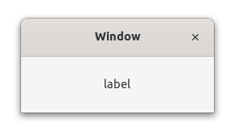

### Requirement

- php (8.1)
- ext-FFI
- gtk-4

**Installation**

```bash
composer require pgtk/gtk
```
**Example:**


```php
require_once __DIR__ . '/vendor/autoload.php';

use PGtk\Gtk\Gtk;
use PGtk\Gtk\Gtk\Window;
use PGtk\Gtk\Gtk\HeaderBar;
use PGtk\Gtk\Gtk\Label;
use PGtk\Gtk\GLib\MainContext;

Gtk::getInstance(__DIR__ . '/libs/_build/gtk/libgtk-4.so');

$run = true;

$window = new Window();
$window->setTitle('Window');

$headerBar = new HeaderBar();
$headerBar->setDecorationLayout('menu:close');
$window->setTitlebar($headerBar);

$label = new Label('label');

$window->setChild($label);

$window->widget->GObject->connect('destroy', function () use (&$run) {
    $run = false;
});
$window->widget->show();

while ($run) {
    MainContext::iteration(true);
}
```